# Host-Guest Socket Protocol

## Wire Format

Length-prefixed JSON over a Unix stream socket:

<p align="center">
  <picture>
    <source media="(prefers-color-scheme: dark)" srcset="assets/wire_format.svg">
    
  </picture>
</p>

## Socket Location

| Socket | Path | Created by |
|--------|------|------------|
| Host socket | `$XDG_RUNTIME_DIR/podbox/<name>.sock` | `.socket` Quadlet unit |
| Local guest socket | `/run/podbox/guest-<name>.sock` | `podbox-guest --daemon` |

The host socket is created by systemd before the container starts and persists across restarts. The guest socket is used by interceptor processes to communicate with the local daemon.

## Handshake

**Guest sends:**

```json
{
  "type": "hello",
  "version": "0.1.0",
  "container": "myenv",
  "capabilities": ["notify", "xdg_open", "clipboard", "host_exec"]
}
```

**Host responds:**

```json
{
  "type": "hello_ack",
  "accepted": ["notify", "xdg_open"],
  "rejected": ["clipboard", "host_exec"],
  "idle_timeout_secs": 0
}
```

The handshake decides which capabilities the guest may use
(`0` timeout = disabled). The guest only installs interceptor symlinks for
accepted ones.

## Message Types

### Guest → Host

| Type | Fields |
|------|--------|
| `hello` | `protocol_version`, `guest_version`, `container`, `capabilities` |
| `notify` | `summary`, `body`, `urgency`, `actions` (optional), `app_name` (optional) |
| `xdg_open` | `uri` |
| `clipboard_set` | `text` |
| `clipboard_get` | — |
| `host_exec` | `cmd`, `args` |
| `register_session` | — (pidfd via `SCM_RIGHTS`) |
| `busy` | — |
| `idle_timeout` | — |

### Host → Guest

| Type | Fields |
|------|--------|
| `hello_ack` | `accepted`, `rejected`, `idle_timeout_secs` |
| `clipboard_data` | `text` |
| `host_exec_stdout` | `data` |
| `host_exec_stderr` | `data` |
| `host_exec_done` | `exit_code` |
| `notify_action_result` | `notification_id`, `action_key` |
| `ping` | — |
| `check_idle` | — |
| `shutdown` | — |

## Notify actions

`actions` is an optional array of `{key, label}`. The host replies with
`notify_action_result` carrying the `notification_id` and the chosen
`action_key`.

```json
{
  "type": "notify",
  "summary": "Build complete",
  "body": "Exit code: 0",
  "actions": [
    { "key": "open", "label": "Open project" },
    { "key": "dismiss", "label": "Dismiss" }
  ]
}
```

Older guests omit `actions`/`app_name` — both default empty server-side.

## Capabilities

One interceptor symlink per capability. Rejected ones are skipped silently —
no symlink, no retries.

| Capability | Interceptor | Description |
|------------|-------------|-------------|
| `notify` | `notify-send` | Desktop notification forwarding |
| `xdg_open` | `xdg-open` | URI opening via host |
| `clipboard` | `podbox-clipboard` | Clipboard sharing |
| `host_exec` | `host-exec` | Execute commands on host |